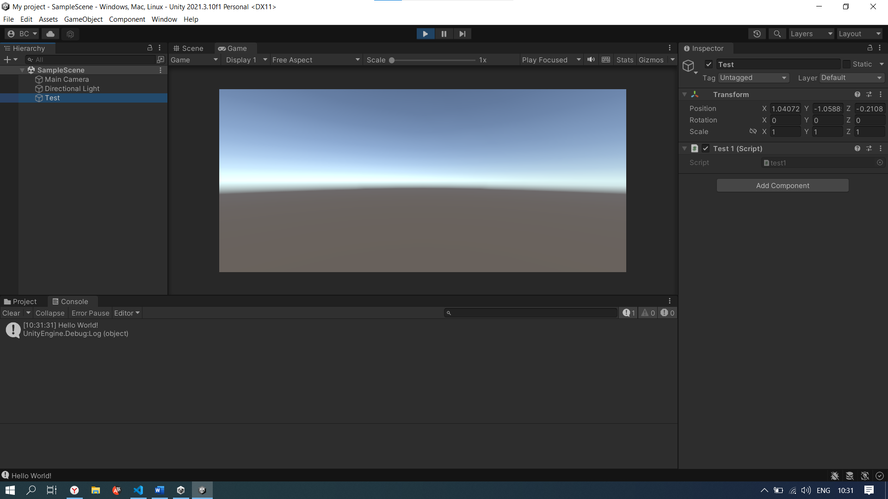
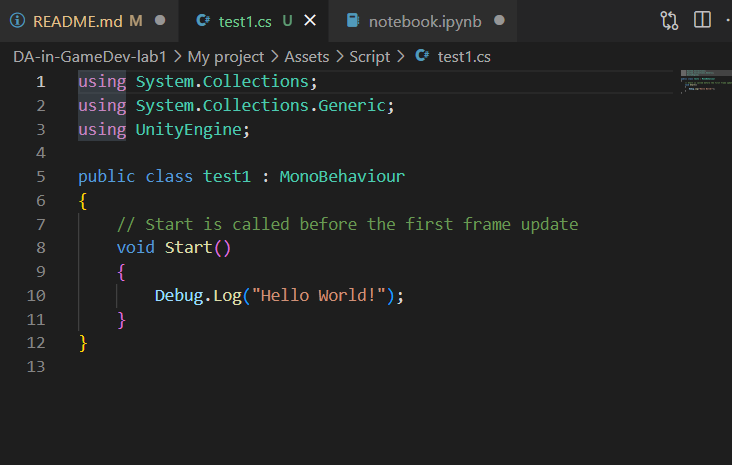
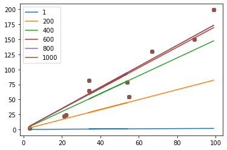

# АНАЛИЗ ДАННЫХ И ИСКУССТВЕННЫЙ ИНТЕЛЛЕКТ [in GameDev]
Отчет по лабораторной работе #1 выполнил:
- Смирнов Владимир Владимирович
- ХИЭ21

Отметка о выполнении заданий:

| Задание | Выполнение | Баллы |
| ------ | ------ | ------ |
| Задание 1 | * | 60 |
| Задание 2 | * | 20 |
| Задание 3 | * | 20 |

знак "*" - задание выполнено; знак "#" - задание не выполнено;

Работу проверили:
- к.т.н., доцент Денисов Д.В.
- к.э.н., доцент Панов М.А.
- ст. преп., Фадеев В.О.

## Цель работы
Научиться работать на базовом уровне с Jupyter Notebook и Unity, чтобы проверить их работоспособность.
Ознакомиться с основными операторами зыка Python на примере реализации линейной регрессии.

## Задание 1
В ходе работы был создан документ в google colab и выплонен код, выводящий в консоль "Hello world!".

https://colab.research.google.com/drive/1ov6v2oRgW9MUVcg2n0TWW0HQVThYccvJ?usp=sharing

Далее, уже на локальный компьютер был установлен jupyter notebook с помощью anaconda. Задание 3 было выполнено полностью на локальном компьютере.

## Задание 2
- В ходе работы был установлен Unity, создан пустой 3d проект.
- Создан пустой объект Test, к которому был прикреплён скрипт, выводящий Hello World при запуске.



## Задание 3
### Шаг 1
Весь код можно найти и выполнить в файле notebook.ipynb.

Ход работы:
- Произвёл подготовку данных для работы с алгоритмом линейной регрессии. 10 видов данных были установлены случайным образом, и данные находились в линейной зависимости. Данные преобразуются в формат массива, чтобы их можно было вычислить напрямую при использовании умножения и сложения.

```py

In [ ]:
#Import the required modules, numpy for calculation, and Matplotlib for drawing
import numpy as np
import matplotlib.pyplot as plt
#This code is for jupyter Notebook only
%matplotlib inline

# define data, and change list to array
x = [3,21,22,34,54,34,55,67,89,99]
x = np.array(x)
y = [2,22,24,65,79,82,55,130,150,199]
y = np.array(y)

#Show the effect of a scatter plot
plt.scatter(x,y)
```

Рисунок 1 \


- Определил связанные функции. Функция модели: определяет модель линейной регрессии wx+b. Функция потерь: функция потерь среднеквадратичной ошибки. Функция оптимизации: метод градиентного спуска для нахождения частных производных w и b. Lr сделал параметром, а не константой, для удобного проведения экспериментов в последующих заданиях.

```py
def model(a, b, x):
    return a*x + b

def loss_function(a, b, x, y):
    num = len(x)
    prediction=model(a,b,x)
    return (0.5/num) * (np.square(prediction-y)).sum()

def optimize(Lr, a,b,x,y):
    num = len(x)
    prediction = model(a,b,x)
    da = (1.0/num) * ((prediction -y)*x).sum()
    db = (1.0/num) * ((prediction -y).sum())
    a = a - Lr*da
    b = b - Lr*db
    return a, b

def iterate(Lr, a,b,x,y,times):
    for i in range(times):
        a,b = optimize(Lr, a,b,x,y)
    return a,b
```

#### Инициализация
 Задаём параметры a_f, b_f и делаем их копию в a, b для чистоты последующих экспериментов. n_a - массив необходимого количества итераций для разных экспериментов c итеративной оптимизацией, чтобы избежать дублирования кода. 
```py
Lr = 0.000001
a_f = np.random.rand(1)
print(a_f)
b_f = np.random.rand(1)
print(b_f)

a = np.copy(a_f)
b = np.copy(b_f)
n_a = np.arange(1, 6) * 200
n_a = np.concatenate([[1], n_a])
a_loss = []
```

#### Итеративная оптимизация 
- Для каждой итерации отображаются значения параметров, значения потерь и эффекты визуализации после итерации на одном графике, в массив loss записываются потери для каждой итерации, для выполнения следующего задания.
```py
for n in n_a:
    a,b = iterate(Lr, a,b,x,y, n)
    prediction=model(a,b,x)
    loss = loss_function(a, b, x, y)
    a_loss.append(loss)

    print(a,b,loss)
    plt.scatter(x,y)
    plt.plot(x,prediction, label=n)

plt.legend(loc='best')
plt.show()
```

Рисунок 2 \


### Шаг 2
- Должна ли величина loss стремиться к нулю при изменении исходных данных? Ответьте на вопрос, приведите пример выполнения кода, который подтверждает ваш ответ.

- Lr изменяется от 1e-08 до 1e-05, уменьшаясь на каждой итерации в 10 раз. Значения параметров a, b каждый раз возвращаются к исходным значениям для чистоты эксперимента. Из рисунка 3 видно, что loss уменьшается от итерации к итерации быстрее, если параметр Lr больше. Всё таки, loss стремится не к нулю, а перестаётся уменьшаться в районе 190. Это связано с тем, что линейная функция не может точно соответствовать не совсем линейным данным, что видно из рисунка 2, но чем больше количество итераций, тем точнее будет выявлена линейная функция. 

```py
Lr = Lr * 0.01
for i in range (1, 5):
    a = np.copy(a_f)
    b = np.copy(b_f)
    a_loss = []
    for n in n_a:
        a,b = iterate(Lr, a,b,x,y, n)
        loss = loss_function(a, b, x, y)
        a_loss.append(loss)
    plt.plot(n_a, a_loss, label=Lr)
    Lr = Lr * 10

plt.legend(loc='best')
plt.show()
```

Рисунок 3 \


### Шаг 3
- Какова роль параметра Lr? Ответьте на вопрос, приведите пример выполнения кода, который подтверждает ваш ответ. В качестве эксперимента можете изменить значение параметра.

- Lr - это learning rate, коэффициент скорости обучения. Из рисунка 3, построенного в задании 2 видно, что увеличение Lr приводит к тому, что требуется меньше итераций, чтобы уменьшить loss.


## Выводы
В ходе лаборатоной работы я ознакомился с основными операторами Python и библиотеками numpy, matplotlib на примере линейной регрессии, установил инструментарий Unity и Python, проверил их. Я узнал, что применительно к линейной регрессии, с постоянным набором данных, увеличение параметра скорости обучения в разумных пределах позволяет снизить необходимое количество итераций для выявления линейной функции. Чем точнее выявлена линейная функция, тем меньше величина, вычисленная функцией потерь среднеквадратичной ошибки.

## Powered by

**BigDigital Team: Denisov | Fadeev | Panov**
