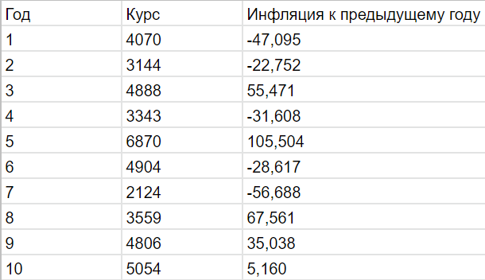
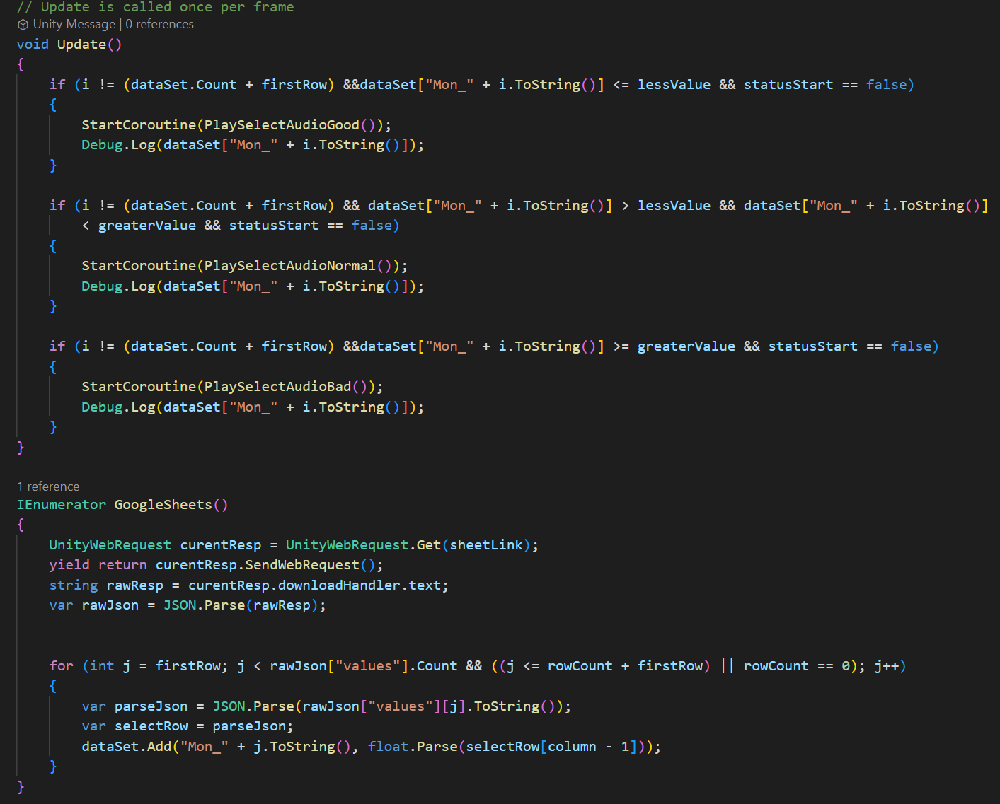
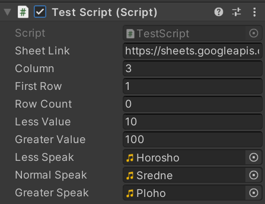
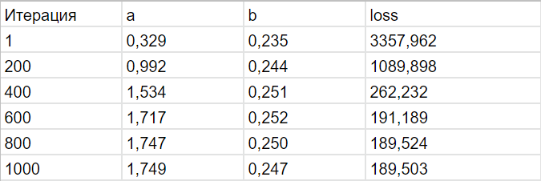
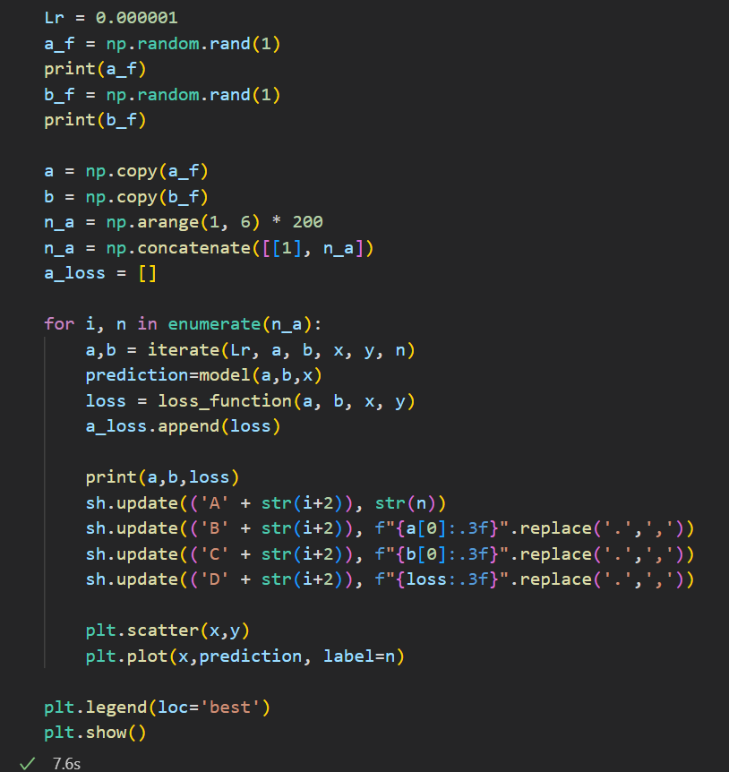
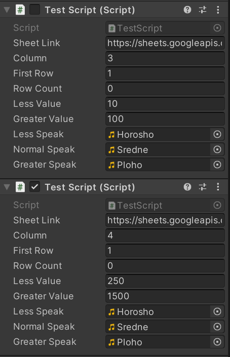

# АНАЛИЗ ДАННЫХ И ИСКУССТВЕННЫЙ ИНТЕЛЛЕКТ [in GameDev]
Репозиторий основан на https://github.com/Den1sovDm1triy/DA-in-GameDev-lab1/blob/main/README.md \

Отчет по лабораторной работе #1 выполнил:
- Смирнов Владимир Владимирович
- ХИЭ21

Отметка о выполнении заданий:

| Задание | Выполнение | Баллы |
| ------ | ------ | ------ |
| Задание 1 | * | 60 |
| Задание 2 | * | 20 |
| Задание 3 | * | 20 |

знак "*" - задание выполнено; знак "#" - задание не выполнено;

Работу проверили:
- к.т.н., доцент Денисов Д.В.
- к.э.н., доцент Панов М.А.
- ст. преп., Фадеев В.О.

## Цель работы
Познакомиться с программными средствами для организции 
передачи данных между инструментами google, Python и Unity

## Задание 1
1. Реализовал совместную работу и передачу данных в связке Python - Google-Sheets – Unity.
2. В облачном сервисе google console подключил API для работы с google sheets и google drive.
3. Реализовал запись данных из скрипта на python в google-таблицу. Данные описывают изменение темпа инфляции на протяжении 10 отсчётных периодов, с учётом стоимости игрового объекта в каждый период.  
4. Создал новый проект на Unity, который получает данные из google-таблицы, в которую были записаны данные в предыдущем пункте.
5. Написал функционал на Unity, в который воспроизводит аудио-файл в зависимости от значения данных из таблицы. 

6. Добавил возможность кастомизировать скрипт под разные таблицы.

7. Скрипт выводит звук Horosho, если значение меньше 10. Если значение больше 10 и меньше 100, то выводится звук Sredne. Если значение больше 100, то выводится звук Ploho. Первая строка пропускается, данные считываются с третей колонки. Значение RowCount=0 означет, что скрипт будет читать данные из столбца, пока они не закончатся.

## Задание 2
- Реализовал запись в Google-таблицу (второй лист) набора данных, полученных с помощью линейной регрессии из лабораторной работы № 1.

## Задание 3
1. Самостоятельно разработал сценарий воспроизведения звукового
сопровождения в Unity в зависимости от изменения считанных данных в задании 2.
2. Создал копию скрипта, но уже со ссылкой не на первый, а на второй лист таблицы. Скрипт считывает данные с четвёртой колонки (D). Если loss больше 1500, то выводится звук Ploho, если loss от 250 до 1500, то выводится звук Sredne, если loss меньше 250, то выводится звук Horosho.

## Выводы
В ходе лаборатоной работы я научился создавать набор данных, который передаётся в google-таблицу с целью
возможности дальнейшего их наглядного представляния и оптимизации. Также в
этой лабораторной работе на движке Unity я реализовал реализован функционал,
позволяющий воспроизводить аудио-файлы со звуковой информацией в
зависимости от значений входного набора данных из произвольной таблицы.

## Powered by

**BigDigital Team: Denisov | Fadeev | Panov**

