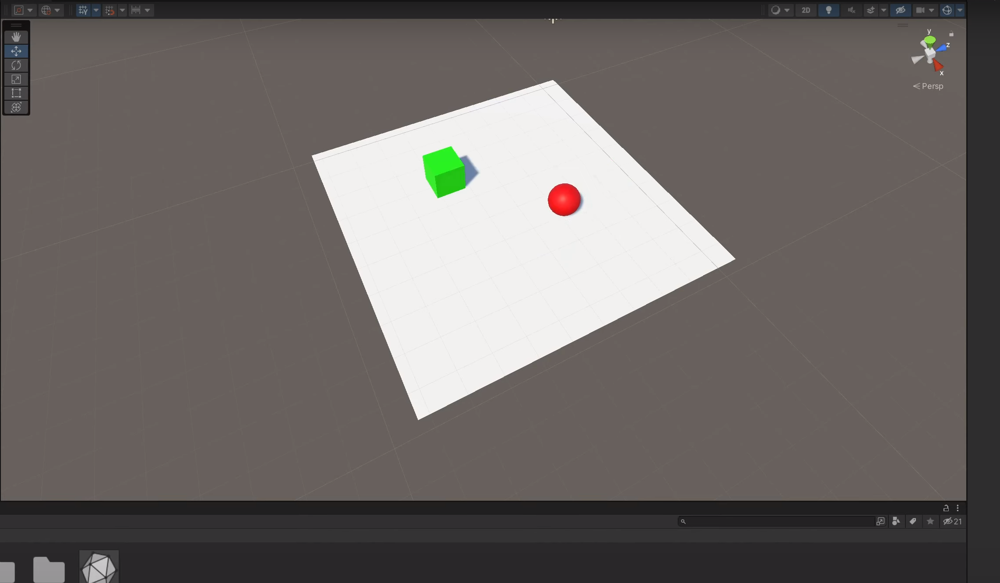
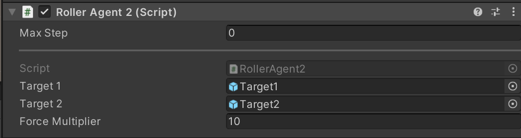
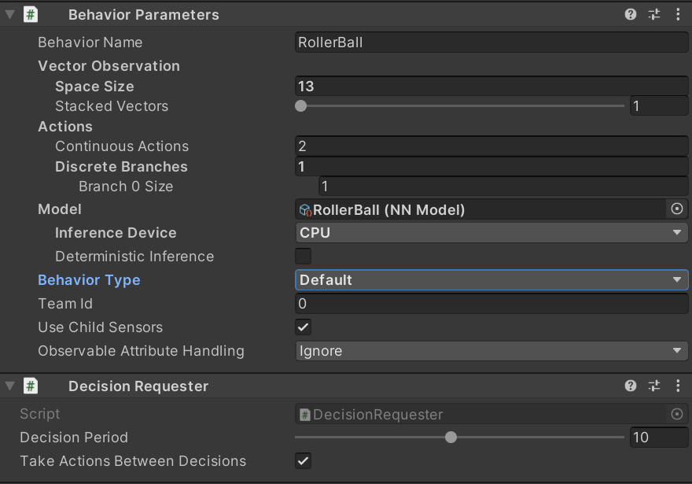
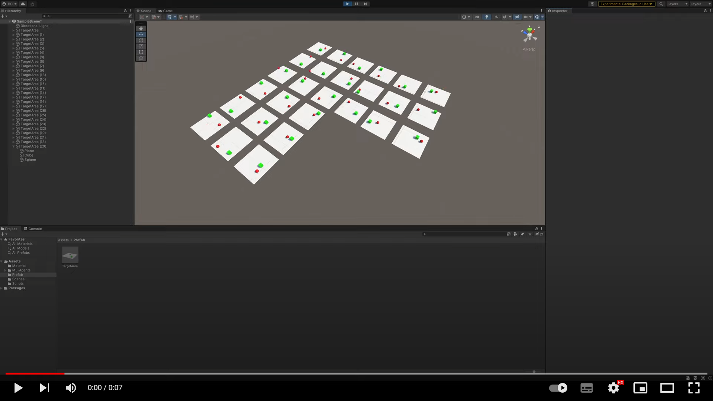
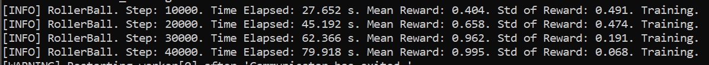
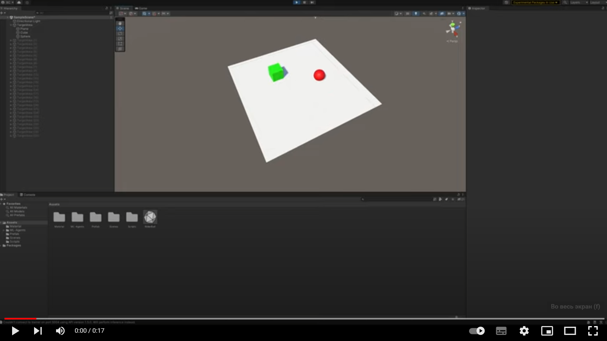
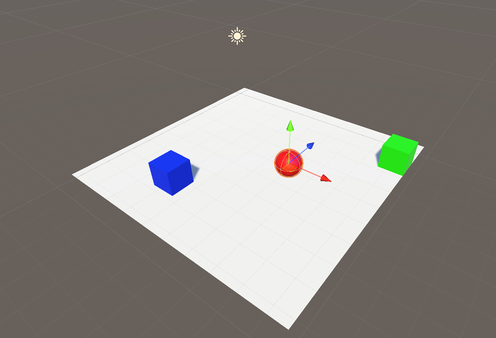
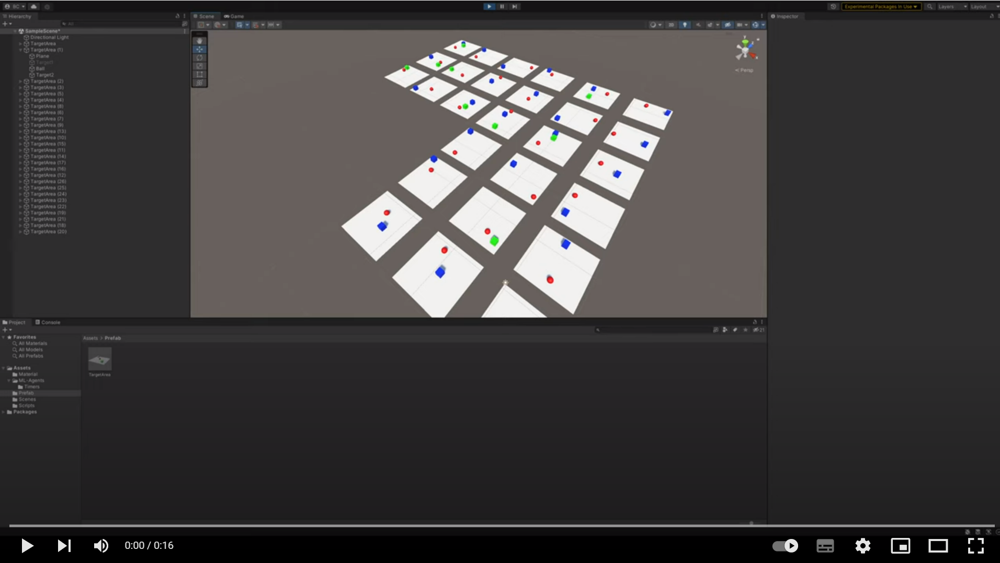
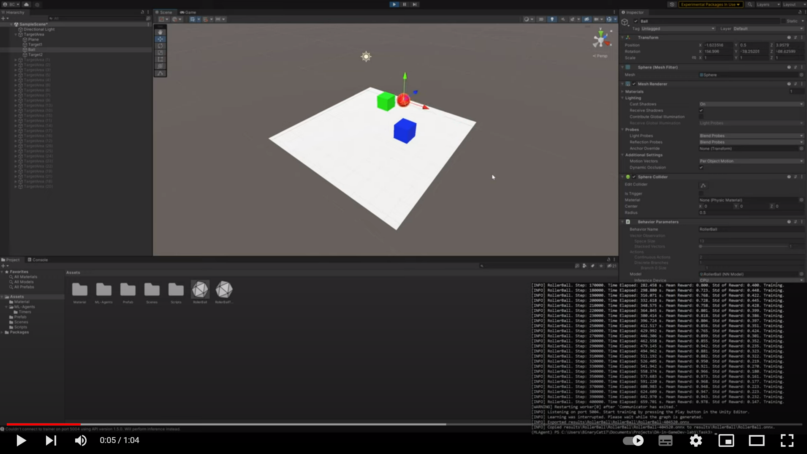

# АНАЛИЗ ДАННЫХ И ИСКУССТВЕННЫЙ ИНТЕЛЛЕКТ [in GameDev]
Репозиторий основан на https://github.com/Den1sovDm1triy/DA-in-GameDev-lab1/blob/main/README.md \

Отчет по лабораторной работе выполнил:
- Смирнов Владимир Владимирович
- ХИЭ21

Отметка о выполнении заданий:

| Задание | Выполнение | Баллы |
| ------ | ------ | ------ |
| Задание 1 | * | 60 |
| Задание 2 | * | 20 |
| Задание 3 | * | 20 |

знак "*" - задание выполнено; знак "#" - задание не выполнено;

Работу проверили:
- к.т.н., доцент Денисов Д.В.
- к.э.н., доцент Панов М.А.
- ст. преп., Фадеев В.О.

## Цель работы
Познакомиться с программными средствами для создания системы машинного обучения и ее интеграции в Unity.

## Задание 1
1. Через Anaconda Prompt установил пакеты mlagents и torch
2. Создал на сцене плоскость, куб и сферу, объединил их в префаб

3. Добавил скрипт-файл RollerAgent.cs к сфере

4. Объекту «сфера» добавил компоненты Decision Requester, Behavior Parameters

5. Запустил mlagents-learn на основе файла конфигурации rollerball_config.yaml и с удалением результатов предыдущих обучений.
```
mlagents-learn rollerball_config.yaml --run-id=RollerBall --force
```
6. Запустил работу ML-агента на 1, 3, 9, 27 копиях модели Плоскость-Сфера-Куб.
- [](https://www.youtube.com/watch?v=rlo8nXWcBoc)
- 
7. Проверил работу модели. 
- [](https://www.youtube.com/watch?v=ENUMo3-yo_M)
8. ML-агент натренировался с очень высокой средней наградой - 0.995 и собирает кубик почти идеально, но всё же может выпасть за пределы плоскости, если кубик был на самом краю

## Задание 2
Компонент Decision Requester запрашивает решения для агента через раные промежутки времени, вызывая функцию RequestDecision у класса Agent, от которого наследуется скрипт.
- Параметр Decision Period определяет частоту, с которой агент запрашивает решение.
- Период принятия решения, равный n, означает, что Агент будет запрашивать решение каждые n шагов обучения.

Компонент Behavior Parameters (параметры поведения) определяет, как объект принимает решения.
- Behavior Name. Имя этого поведения, которое используется в качестве базового имени и указывается в файле конфигурации модели.
- Behavior Type. Определяет, какой тип поведения будет использовать Агент. Default - Агент будет использовать удаленный процесс обучения, запущенный через python для принятия решений. InferenceOnly агент всегда будет использовать предоставленную моделью нейронной сети. HeuristicOnly - всегда используется эвристический метод.
- Model. Используемая модель нейронной сети.
- InferenceDevice. Выбор между CPU и GPU для предоставленной модели нейронной сети.
- Vector Observation. Вектор наблюдения - это вектор чисел с плавающей запятой, которые содержат релевантную информацию для принятия агентом решений. Вектор заполняется в функции CollectObservations.
```cs
    public override void CollectObservations(VectorSensor sensor)
    {
        sensor.AddObservation(Target1.transform.localPosition);
        sensor.AddObservation(Target1.transform.localPosition);
        sensor.AddObservation(active1);
        sensor.AddObservation(active2);
        sensor.AddObservation(this.transform.localPosition);
        sensor.AddObservation(rBody.velocity.x);
        sensor.AddObservation(rBody.velocity.z);
    }
```

- Actions. Агенту даются инструкции в форме действий. Действия делятся на два типа: непрерывные и дискретные. Branch Sizes определяет массив размеров ветвей для дискретных действий. Continuous Actions определяет количество доступных непрерывных действий. Алгоритм обучения ничего не знают о том, что означают сами значения действия. Алгоритм обучения просто пробует разные значения для списка действий (ActionBuffers) и наблюдает за влиянием накопленных вознаграждений с течением времени и многих эпизодов обучения. Таким образом, единственное место, где действия определяются для Агента - это функция OnActionReceived(). В данном примере к шарику применяется сила в зависимости от значений в ActionBuffers, а сами значения подбирает алгоритм обучения.
```cs
    public override void OnActionReceived(ActionBuffers actionBuffers)
    {
        Vector3 controlSignal = Vector3.zero;
        controlSignal.x = actionBuffers.ContinuousActions[0];
        controlSignal.z = actionBuffers.ContinuousActions[1];
        rBody.AddForce(controlSignal * forceMultiplier);
    ...
```

Файл конфигурации rollerball_config.yaml настраивает процесс обучения модели с помощью mlagents-learn
```yaml
# набор конфигураций для разных типов поведения агентов
behaviors:
  RollerBall:
    # Proximal Policy Optimization - это алгоритм обучения с подкреплением от OpenAI
    trainer_type: ppo
    # гиперпараметры
    hyperparameters:
      # Количество опытов на каждой итерации градиентного спуска.
      batch_size: 10
      # Количество опыта, который необходимо собрать перед обновлением модели политики. Соответствует тому, сколько опыта должно быть собрано, прежде чем мы приступим к какому-либо изучению или обновлению модели. 
      buffer_size: 100
      # Начальная скорость обучения для градиентного спуска. Соответствует силе каждого шага обновления градиентного спуска.
      learning_rate: 3.0e-4
      # Сила регуляризации энтропии, которая делает политику "более случайной". Это гарантирует, что агенты должным образом исследуют пространство действий во время обучения. 
      beta: 5.0e-4
      # Соответствует допустимому порогу расхождения между старой и новой политиками при обновлении с градиентным спуском. Установка этого значения небольшим приведет к более стабильным обновлениям, но также замедлит процесс обучения.
      epsilon: 0.2
      # насколько агент полагается на свою текущую оценку значений при расчете предсказаний. Высокие значения соответствуют тому, что агент больше полагается на фактические вознаграждения, полученные в окружающей среде
      lambd: 0.99
      # Количество проходов, которые необходимо выполнить через буфер опыта при выполнении оптимизации градиентного спуска.
      num_epoch: 3
      # Определяет, как скорость обучения меняется с течением времени.
      learning_rate_schedule: linear
    # настройки нейронной сети
    network_settings:
      # Применяется ли нормализация к входным данным векторного наблюдения. 
      normalize: false
      # Количество нейронов в скрытых слоях нейронной сети
      hidden_units: 128
      # Количество скрытых слоев в нейронной сети. Соответствует количеству скрытых слоев, присутствующих после входящих данных
      num_layers: 2
    # настройки для внешних и внутренних сигналов вознаграждения
    reward_signals:
      extrinsic:
        # Коэффициент дисконтирования для будущих вознаграждений, поступающих от окружающей среды. Это можно рассматривать как то, насколько далеко в будущем агент должен заботиться о возможных вознаграждениях.
        gamma: 0.99
        # Значение, на которое можно умножить вознаграждение, получаемое от окружающей среды
        strength: 1.0
    # общее количество шагов до завершения обучения
    max_steps: 500000
    # Сколько шагов опыта нужно собрать для каждого агента, прежде чем добавлять его в буфер опыта.
    time_horizon: 64
    # Количество опыта, которое необходимо собрать перед созданием и отображением статистики обучения.
    summary_freq: 10000
    # использовать мультипоточность
    threaded: true
```


## Задание 3
Доработал сцену, скрипт и обучил ML-Agent таким образом, чтобы шар перемещался между двумя кубами разного цвета.


В класс RollerAgent добавил вторую цель, а также парамет active, говорящий о том, был ли собран кубик. revard накапливает награду за собранные кубики по 0.5 за каждый.
```cs
    ...
    public GameObject Target1;
    private bool active1 = false;
    public GameObject Target2;
    private bool active2 = false;
    private float revard = 0.0f;
    ...
```

В функции OnEpisodeBegin теперь позиция задаётся двум кубам случайным образом. Сбрасывается награда и кубы становятся видимыми.
```cs
    public override void OnEpisodeBegin()
    {
        ...
        Target1.transform.localPosition = new Vector3(Random.value * 8-4, 0.5f, Random.value * 8-4);
        Target2.transform.localPosition = new Vector3(Random.value * 8-4, 0.5f, Random.value * 8-4);

        revard = 0.0f;
        active1 = true;
        active2 = true;
        Target1.SetActive(true);
        Target2.SetActive(true);
    }
```

В функцию CollectObservation добавлено считывание параметра, отвечающего за то, был ли собран каждый куб. Добавлено наблюдение за позицией второго куба.
```cs
    public override void CollectObservations(VectorSensor sensor)
    {
        sensor.AddObservation(Target1.transform.localPosition);
        sensor.AddObservation(Target2.transform.localPosition);
        sensor.AddObservation(active1);
        sensor.AddObservation(active2);
        sensor.AddObservation(this.transform.localPosition);
        sensor.AddObservation(rBody.velocity.x);
        sensor.AddObservation(rBody.velocity.z);
    }
```

Функция OnActionReceived на основе дистации до каждого из кубиков определяет, было ли попадание. В случае попадания кубик скрывается, а к награде добавляется 0.5f. Если два кубика были сбиты или шарик выпал, то эпизод заканчивается.
```cs
    public override void OnActionReceived(ActionBuffers actionBuffers)
    {
        Vector3 controlSignal = Vector3.zero;
        controlSignal.x = actionBuffers.ContinuousActions[0];
        controlSignal.z = actionBuffers.ContinuousActions[1];
        rBody.AddForce(controlSignal * forceMultiplier);

        float distanceToTarget1 = Vector3.Distance(this.transform.localPosition, Target1.transform.localPosition);
        float distanceToTarget2 = Vector3.Distance(this.transform.localPosition, Target2.transform.localPosition);


        if(active1 && distanceToTarget1 < 1.42f) {
            active1 = false;
            revard += 0.5f;
            Target1.SetActive(false);
        }

        if(active2 && distanceToTarget2 < 1.42f) {
            active2 = false;
            revard += 0.5f;
            Target2.SetActive(false);
        }

        if(this.transform.localPosition.y < 0) {
            EndEpisode();
        } else if((!active1 && !active2)) {
            SetReward(revard);
            EndEpisode();
        }
    }
```

Видео обучения.
- [](https://www.youtube.com/watch?v=33QnuESxIOY)

Лог обучения модели.
- 

Видео обученной модели.
- [](https://www.youtube.com/watch?v=p5JrgFzV5j4)


## Выводы
Игровой баланс - воспринимаемый игроком уровень равновесия между персонажами, командами, способностями и т. п. Хороший баланс должен поддерживать уровень "фана" в небольшом диапазоне, когда игра не кажется слишком простой или не настолько сложная, что хочется её выключить. При этом игрок должен ощущать, что игра честная по отношению к нему. В играх существует огромное разнообразие объектов и добиться синергии между ними очень сложно, особенно в асимметричных играх, где у каждого игрока качественно разные способности и стили игры.

1. Обычно баланс игры в первых версиях задают на интуитивном уровне. Например, задавая характеристики персонажам исходя от образа игрового персонажа или сразу начинать о цифр, например, о размере юнитов, предположив время игры и соответственно определив, как быстро будут умирать юниты и т.п. Но существуют более конкретные подходы.

2. Силу балансируют с помощью транзитивного, интранзитивного и некомпаративного методов. Первый подразумевает прямое сравнение или соотношение характеристик объектов, второй подразумевает сбор статистики об успешности столкновений между разными персонажами в поисках самых слабых и имбовых. Третий вид подразумевает, что ничего с балансом осознанно сделать нельзя из-за принципиальной несравнимости абилок.

3. Есть разнообразные приёмы балансировки. Например, мощность персонажа можно расчитать, как сумму или среднее его характеристик и сталкивать персонажей с похожей мощностью. Можно замерять HPS и DPS и за мощность считать их произведение. Или можно прибегнуть к визуализацию характеристик на графике и интуитивно их корректировать.

Пунты 1, 2 и 3 отличаются степенью формальности и точности баланса, но в играх с большим количество разных объектов, способностей приходится очень-очень долго играть в игру совершенно разным людям и настраивать баланс. Машинное обучение способно решить эту проблему, так как столкновение различных игровых агентов можно автоматизировать и выявлять наиболее сильные и слабые из них. Каждый игровой персонаж, которым ранее должен был управлять человек, заменяется на агента, которому доступны те же способности и возможности, что и реальному игроку. Сталкивая таких объектов тысячи раз можно выявить какие-то имбовые стратегии поведения и бороться с ними.

В теории, можно не ограничиваться на автоматизации сбора статистики и информации. Если запустить несколько процессов обучения параллельно и в каждом численно изменить правила игры, то можно выявить, какие значения характеристик способствуют более лучшему балансу. Естественно, нужно не забывать вручную органичивать возможные пределы изменений характеристик у персонажей так, чтобы они соответствовали их визуальному облику и не казались странными. Такой метод баланса не может учесть субъективные ощущения игрока, а степень удовольствия от игры определяется не только балансом, поэтому нельзя полностью полагаться на машинное обучение, а лишь использовать его как дополнительный инструмент.

## Powered by

**BigDigital Team: Denisov | Fadeev | Panov**
